# Phase 0: Polyglot Foundations — Mental Model & Execution Pipelines

> **Mastering Language Runtimes from Source Code to Silicon**  
> *A foundational guide to understanding how modern programming languages work, how computers execute code, and how different language runtimes bridge human ideas to hardware instructions.*

---

## 📑 Table of Contents

- [0.1 What is a Programming Language?](#01-what-is-a-programming-language)
  - [The Fundamental Reality](#the-fundamental-reality)
  - [The Three-Tier Architecture](#the-three-tier-architecture)
  - [The Iceberg Mental Model](#the-iceberg-mental-model)
  - [The Abstraction vs. Control Spectrum](#the-abstraction-vs-control-spectrum)
- [0.2 Universal Execution Pipeline: Source Code → Machine Execution](#02-universal-execution-pipeline-source-code--machine-execution)
  - [1. Source Code](#1-source-code)
  - [2. Lexical Analysis (Lexing & Tokens)](#2-lexical-analysis-lexing--tokens)
  - [3. Syntactic Analysis (Parsing & AST)](#3-syntactic-analysis-parsing--ast)
  - [4. Semantic Analysis & Type Checking](#4-semantic-analysis--type-checking)
  - [5. Intermediate Representation (IR / Bytecode)](#5-intermediate-representation-ir--bytecode)
  - [6. Optimization Engine](#6-optimization-engine)
  - [7. Machine Code Generation](#7-machine-code-generation)
  - [8. Target CPU Architectures (ISA)](#8-target-cpu-architectures-isa)
  - [9. Operating System & Binary Loading](#9-operating-system--binary-loading)
  - [10. Hardware Execution (CPU & Memory)](#10-hardware-execution-cpu--memory)
- [0.3 The Polyglot Pipelines Side-by-Side](#03-the-polyglot-pipelines-side-by-side)
  - [Java Pipeline (JVM)](#1-java-jvm-ecosystem)
  - [Python Pipeline (CPython)](#2-python-cpython-interpreter)
  - [JavaScript Pipeline (V8 Engine)](#3-javascript-modern-v8-engine)
  - [TypeScript Pipeline (Transpilation + Runtime)](#4-typescript-type-system--runtime)
  - [Go Pipeline (Native Toolchain)](#5-go-native-aot-toolchain)
  - [C# Pipeline (.NET CoreCLR / NativeAOT)](#6-c-net-ecosystem)
  - [Comparative Pipeline Matrix](#polyglot-runtime-comparison-matrix)
- [0.4 Dispelling the Myth: "Compiled vs. Interpreted" is Not a Binary](#04-dispelling-the-myth-compiled-vs-interpreted-is-not-a-binary)
  - [The Modern Execution Spectrum](#the-modern-execution-spectrum)
  - [AOT (Ahead-of-Time) vs. JIT (Just-in-Time)](#aot-ahead-of-time-vs-jit-just-in-time)
  - [Speculative Optimization & Deoptimization](#speculative-optimization--deoptimization)
- [0.5 Key Takeaways & Study Checklist](#05-key-takeaways--study-checklist)
  - [Core Principles](#core-principles)
  - [Self-Assessment Questions](#self-assessment-questions)

---

## 0.1 What is a Programming Language?

### The Fundamental Reality

A central truth of computer systems is simple:

> [!IMPORTANT]
> **The CPU does not understand Java, Python, JavaScript, TypeScript, Go, or C#.**  
> The CPU is physical silicon with logic gates, registers, and memory buses. It only understands **machine instructions**—streams of binary numbers encoding specific hardware operations.

```
+-------------------------------------------------------------------------------+
|                                  HARDWARE                                     |
|  Does NOT understand:  Java | Python | JavaScript | TypeScript | Go | C#      |
|  ONLY understands:     Opcode bit patterns (e.g., 01001000 10001001 11000011) |
+-------------------------------------------------------------------------------+
```

If we had to instruct the CPU manually, every single operation would require explicit hardware-level commands:

```text
Load memory address 0x7FFF50 into register RAX
Move value 42 into register RBX
Compare RAX and RBX bits
Jump to instruction offset +0x14 if equal
Store RAX into memory buffer address 0x7FFF58
```

Programming languages provide **abstractions** that allow human engineers to express computational intent in expressive, structured formats, while compilers and runtimes translate that intent into machine execution.

---

### The Three-Tier Architecture

Every modern software system operates across three primary layers:

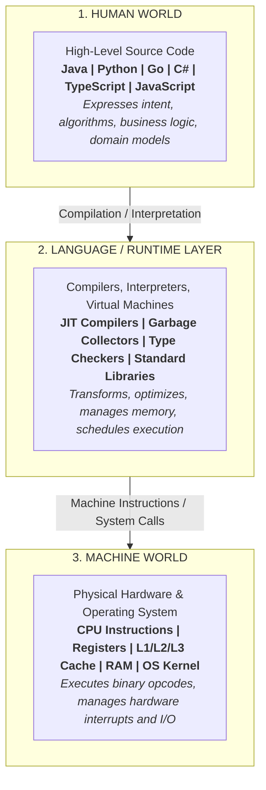

```
┌─────────────────────────────────────────────────────────┐
│                      HUMAN WORLD                        │
│             Java / Python / Go / C# / TS / JS           │
└────────────────────────────┬────────────────────────────┘
                             │  Source Code
                             ▼
┌─────────────────────────────────────────────────────────┐
│                 LANGUAGE & RUNTIME LAYER                │
│    Compiler / Interpreter / VM / JIT / GC / Stdlib      │
└────────────────────────────┬────────────────────────────┘
                             │  Machine Instructions
                             ▼
┌─────────────────────────────────────────────────────────┐
│                      MACHINE WORLD                      │
│     CPU Registers / ALU / Memory / OS Kernel / Silicon  │
└─────────────────────────────────────────────────────────┘
```

---

### The Iceberg Mental Model

What most developers see is only the tip of the programming language iceberg—the syntax. However, true software engineering requires understanding every layer underneath:

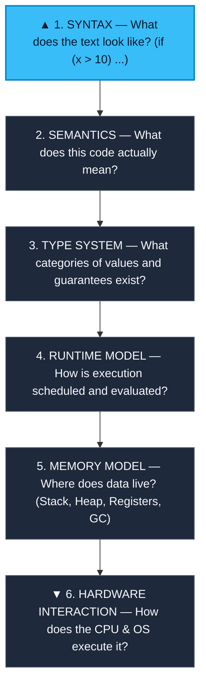

```text
                       ▲
                      / \
                     /   \
                    / CODE\
                   /───────\
                  │ SYNTAX  │  <-- Only ~10% visible (Keywords, brackets, symbols)
       ~~~~~~~~~~~│~~~~~~~~~│~~~~~~~~~~~~~~~~~~~~~~~~~~~~~~~~~~~~~~~~~~~~~~~~~~~~~
                  │SEMANTICS│  <-- What operations and behaviors are meant?
                  ├─────────┤
                  │  TYPES  │  <-- Static vs Dynamic, Strong vs Weak, Memory sizes
                  ├─────────┤
                  │ RUNTIME │  <-- Event loops, Thread pools, Goroutine schedulers
                  ├─────────┤
                  │ MEMORY  │  <-- Stack vs Heap, GC roots, Pointer semantics
                  ├─────────┤
                  │HARDWARE │  <-- Registers, Cache lines, CPU Pipeline, OS Kernel
                  └─────────┘
```

> [!TIP]
> **Key Philosophy:** Learning a new language does not mean memorizing new syntax rules. It means understanding its **computational model**, **memory layout**, and **runtime execution strategy**.

---

### The Abstraction vs. Control Spectrum

Every programming language makes fundamental trade-offs between **developer ergonomics (abstraction)** and **bare-metal efficiency (control)**:

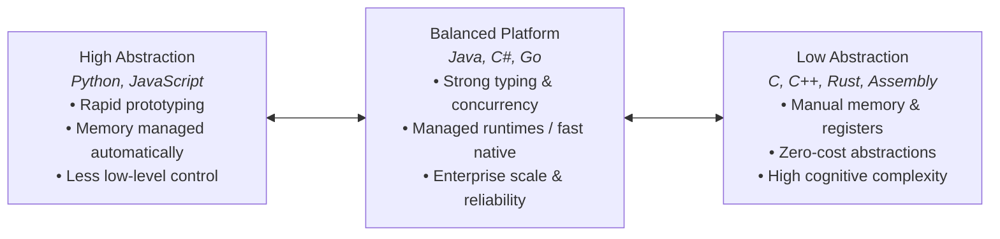

| Trait | High Abstraction (e.g., Python, JS) | Balanced Runtime (e.g., Go, Java, C#) | Low Abstraction (e.g., C, Rust, Zig) |
| :--- | :--- | :--- | :--- |
| **Development Speed** | ⚡ Very Fast | 🚀 Fast to Moderate | ⏱️ Slower / Methodical |
| **Direct Hardware Control** | ❌ Minimal | ⚠️ Moderate / Constrained | ✅ Direct & Total |
| **Memory Management** | 🔄 Automatic (GC / RefCount) | 🔄 Automatic (GC / Tracing) | 🛠️ Manual / Compile-time Ownership |
| **Cognitive Overhead** | 🟢 Low | 🟡 Medium | 🔴 High |
| **Peak Predictability** | ⚠️ Runtime JIT / GC pauses | ⚡ Highly optimized | 🎯 Deterministic cycle-level control |

---

## 0.2 Universal Execution Pipeline: Source Code → Machine Execution

How does human-written source code actually become electric charges firing through a processor? The transformation follows an engineering pipeline composed of **10 critical stages**:

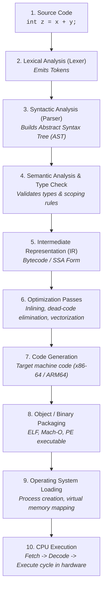

---

### 1. Source Code

Source code is merely a plain-text file containing UTF-8 or ASCII characters:

```c
int z = x + y;
```

At this initial stage, the computer sees only raw character byte values:
`['i', 'n', 't', ' ', 'z', ' ', '=', ' ', 'x', ' ', '+', ' ', 'y', ';']`.

---

### 2. Lexical Analysis (Lexing & Tokens)

The **Lexer** (or Tokenizer) scans the character stream and categorizes characters into structured lexical units called **Tokens**, stripping out meaningless whitespace and comments.

```text
Raw Text: "int z = x + y;"
   │
   ▼
[KEYWORD: "int"]  [IDENTIFIER: "z"]  [OPERATOR: "="]  [IDENTIFIER: "x"]  [OPERATOR: "+"]  [IDENTIFIER: "y"]  [SEMICOLON: ";"]
```

---

### 3. Syntactic Analysis (Parsing & AST)

The **Parser** takes the stream of tokens and evaluates them against the formal grammar of the language. If valid, it produces an **Abstract Syntax Tree (AST)** that reflects the structural hierarchy of the operation.

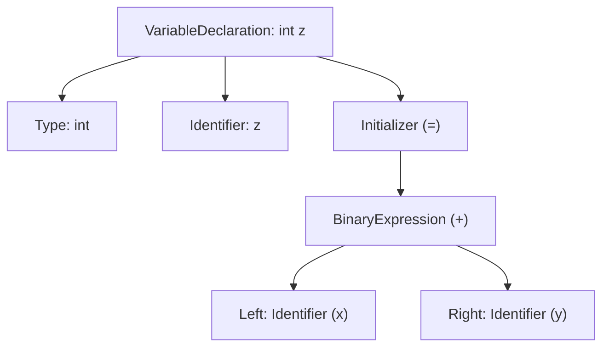

```text
VariableDeclaration
 ├── Type: int
 ├── Name: z
 └── Initializer: Assignment (=)
      └── BinaryExpression (+)
           ├── LeftOperand: Identifier (x)
           └── RightOperand: Identifier (y)
```

> [!NOTE]
> **Syntax Errors** occur here. If you write `int z = + ;`, the lexer recognizes valid tokens, but the parser fails because the sequence violates grammar rules.

---

### 4. Semantic Analysis & Type Checking

Semantic analysis verifies whether a syntactically correct program actually makes logical sense according to language rules:

- **Scope checking:** Have variables `x` and `y` been declared in accessible scopes?
- **Type checking:** Can `x` and `y` be added together? Can the result be stored in an `int`?
- **Mutability & Constness:** Is a `const` or `final` variable being illegally modified?

```text
Syntax Check:    "Is this sentence grammatically valid?"
Semantic Check:  "Does this statement make sense in our universe?"
```

For example:
```typescript
let name: string = "Alice";
let count: number = 42;
let result = name - count; // Syntax is valid, but Semantic Check fails: Operator '-' cannot be applied to 'string' and 'number'.
```

---

### 5. Intermediate Representation (IR / Bytecode)

Once verified, the compiler transforms the AST into an **Intermediate Representation (IR)** or **Bytecode**. IR is an abstract, machine-independent instruction format.

```text
; Conceptual 3-Address Code IR
t0 = LOAD x
t1 = LOAD y
t2 = ADD t0, t1
STORE t2, z
```

#### Why Not Go Directly from Source Code to Machine Code?

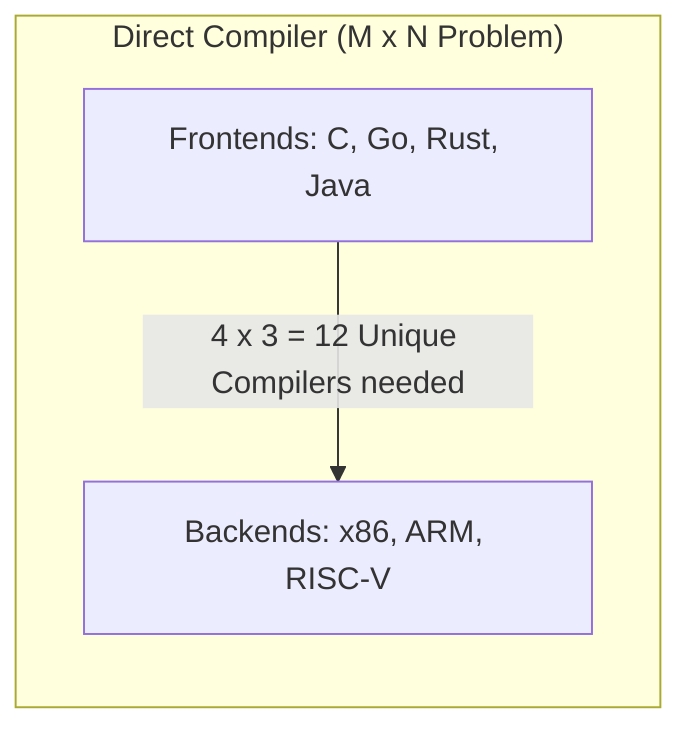

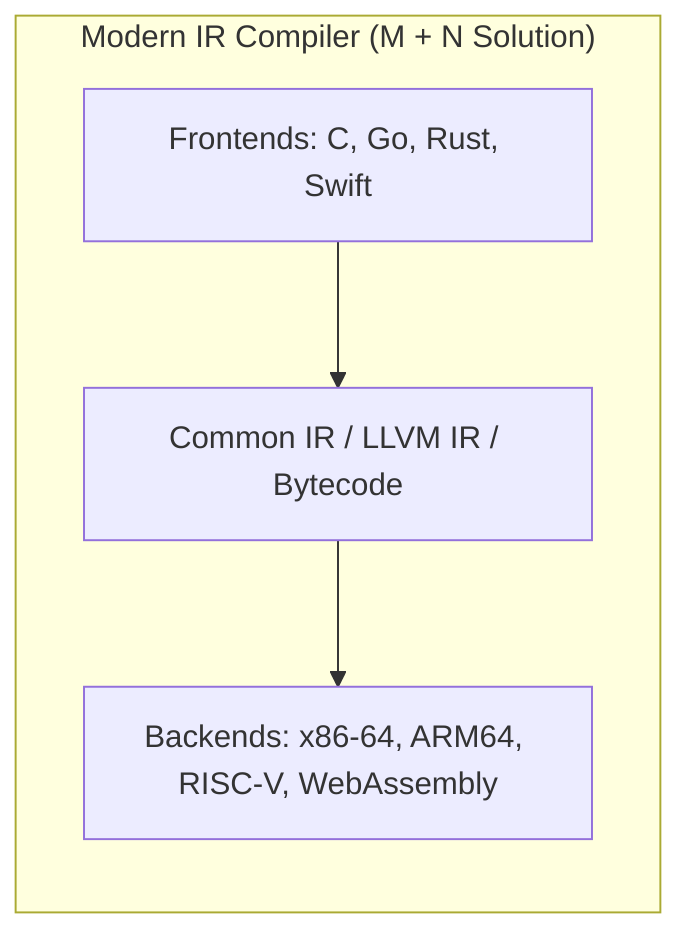

By decoupling the human-facing language frontend from the hardware backend through a shared IR:
1. **Adding a new language** only requires 1 new frontend (translating Source → IR).
2. **Adding a new CPU architecture** only requires 1 new backend (translating IR → Machine Code).
3. Optimization algorithms written for the IR automatically benefit all supported languages.

---

### 6. Optimization Engine

The optimizer transforms the IR to make the program execute faster, occupy less memory, and consume less power without altering observable behavior:

- **Constant Folding:** `int seconds = 60 * 60 * 24;` $\rightarrow$ `int seconds = 86400;`
- **Dead Code Elimination:** Removing `if (false)` blocks and unreachable functions.
- **Function Inlining:** Replacing small function calls with their bodies to eliminate call-stack overhead.
- **Loop Unrolling & Vectorization:** Utilizing SIMD (Single Instruction, Multiple Data) CPU registers.

---

### 7. Machine Code Generation

The compiler backend translates the optimized IR into raw machine code instructions specific to the target architecture's Instruction Set Architecture (ISA):

```nasm
; Conceptual x86-64 Assembly
mov eax, DWORD PTR [rbp-4]    ; Load x into register EAX
add eax, DWORD PTR [rbp-8]    ; Add y to EAX
mov DWORD PTR [rbp-12], eax   ; Store result into z
```

In binary representation:
```text
8B 45 FC       (mov eax, [rbp-4])
03 45 F8       (add eax, [rbp-8])
89 45 F4       (mov [rbp-12], eax)
```

---

### 8. Target CPU Architectures (ISA)

A binary compiled for one architecture cannot run on a different architecture because each processor family has its own Instruction Set Architecture (ISA):

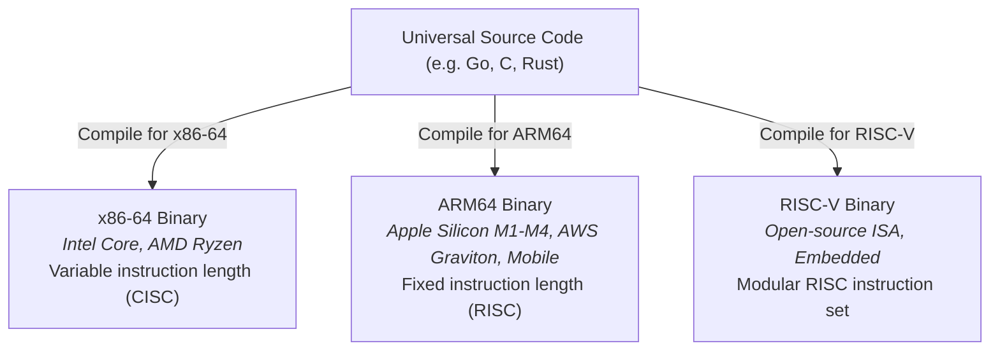

---

### 9. Operating System & Binary Loading

When you run an executable binary (`./app` or `app.exe`), the OS kernel takes charge:
1. **Binary Loader:** Reads the executable file format (**ELF** on Linux, **Mach-O** on macOS, **PE** on Windows).
2. **Virtual Memory Mapping:** Maps code sections (`.text`), read-only data (`.rodata`), and allocates initial Stack and Heap pages.
3. **Dynamic Linking:** Loads required shared libraries (`libc.so`, `kernel32.dll`, `libSystem.dylib`).
4. **Instruction Pointer Init:** Sets the CPU's Program Counter (PC / RIP) to the application entry point (`_start` $\rightarrow$ `main`).

---

### 10. Hardware Execution (CPU & Memory)

The CPU executes instructions via the classic **Instruction Cycle**:

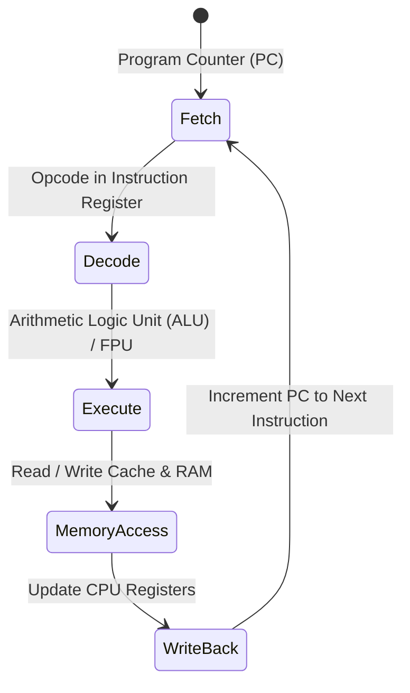

---

## 0.3 The Polyglot Pipelines Side-by-Side

Every major language ecosystem adopts a distinct path along this pipeline. Below are the 6 foundational languages compared directly.

```mermaid
flowchart LR
    subgraph JavaFlow["☕ Java"]
        J1[".java"] --> J2["javac"] --> J3[".class Bytecode"] --> J4["JVM (HotSpot)"] --> J5["JIT (C1/C2)"] --> J6["CPU"]
    end
    subgraph PythonFlow["🐍 Python"]
        P1[".py"] --> P2["CPython Parser"] --> P3[".pyc Bytecode"] --> P4["CPython VM (Eval Loop)"] --> P5["C Runtime Execution"] --> P6["CPU"]
    end
    subgraph JSFlow["🟨 JavaScript"]
        JS1[".js"] --> JS2["V8 Parser"] --> JS3["Ignition Bytecode"] --> JS4["TurboFan JIT"] --> JS5["Machine Code"] --> JS6["CPU"]
    end
    subgraph TSFlow["🔷 TypeScript"]
        TS1[".ts"] --> TS2["tsc Type Check"] --> TS3["Transpiled .js"] --> TS4["JS Engine"] --> TS5["JIT / Interpreter"] --> TS6["CPU"]
    end
    subgraph GoFlow["🔵 Go"]
        G1[".go"] --> G2["Go Compiler (gc)"] --> G3["SSA Optimization"] --> G4["Native Machine Code"] --> G5["OS Binary"] --> G6["CPU"]
    end
    subgraph CSharpFlow["🟣 C#"]
        C1[".cs"] --> C2["Roslyn Compiler"] --> C3["CIL / MSIL Bytecode"] --> C4[".NET CoreCLR"] --> C5["RyuJIT / NativeAOT"] --> C6["CPU"]
    end
```

---

### 1. Java (JVM Ecosystem)

```
Java Source (.java)
       │
       ▼  [javac Compiler]
JVM Bytecode (.class / .jar)
       │
       ▼  [Java Virtual Machine (HotSpot)]
 ┌───────────────────────────────┐
 │ • Interpreter (Zero warmup)   │
 │ • Tier 1 JIT (C1 Compiler)    │
 │ • Tier 2 JIT (C2 Compiler)    │
 │ • Garbage Collector (G1/ZGC)  │
 └───────────────┬───────────────┘
                 │
                 ▼
     Native Machine Code ──▶ CPU
```

- **Philosophy:** *"Write Once, Run Anywhere"* (WORA).
- **Core Mechanism:** `javac` produces portable bytecode. At runtime, the JVM starts interpreting immediately, profiles hot code paths, and JIT-compiles frequently executed methods into machine code.

---

### 2. Python (CPython Interpreter)

```
Python Source (.py)
       │
       ▼  [CPython Compiler]
Bytecode (.pyc / __pycache__)
       │
       ▼  [CPython Virtual Machine]
 ┌───────────────────────────────┐
 │ • C-based Evaluation Loop     │
 │   (ceval.c / bytecode dispatch)│
 │ • Reference Counting + CycleGC│
 │ • GIL (Global Interpreter Lock│
 └───────────────┬───────────────┘
                 │
                 ▼
      Direct C/OS Calls ──▶ CPU
```

- **Philosophy:** Developer velocity, clarity, and vast ecosystem integration.
- **Core Mechanism:** Standard CPython compiles source to bytecode on the fly and interprets it via a large `switch` loop written in C. Python delegates performance-heavy tasks to C/C++/Rust extensions (e.g., NumPy, PyTorch).

---

### 3. JavaScript (Modern V8 Engine)

```
JavaScript Source (.js)
       │
       ▼  [V8 Parser & AST]
Ignition Bytecode
       │
       ▼  [V8 Ignition Interpreter]
Profiler (Watches Hot Functions & Types)
       │
       ▼  [TurboFan Optimizing JIT]
Optimized Native Machine Code
       │ (If type assumption fails)
       ▼
Deoptimization (Bailout back to Ignition Bytecode)
```

- **Philosophy:** Instant execution on the web, dynamic flexibility, high peak performance.
- **Core Mechanism:** V8 starts execution instantly using the **Ignition** bytecode interpreter. When a function runs repeatedly with consistent data types, **TurboFan** JIT-compiles it directly into machine code.

---

### 4. TypeScript (Type System + Runtime)

```
TypeScript Source (.ts)
       │
       ▼  [tsc / esbuild / SWC]
Type Check (Static Analysis)  ──▶  (Strip types & transpile)
       │
       ▼
JavaScript Code (.js)
       │
       ▼
Standard JavaScript Engine (V8 / JavaScriptCore / SpiderMonkey)
       │
       ▼
JIT / Bytecode Execution ──▶ CPU
```

- **Philosophy:** Type safety and scalable developer ergonomics during development, with standard JavaScript ubiquity at runtime.
- **Core Mechanism:** TypeScript types exist **only at compile time**. The transpiler strips away all types, leaving standard JavaScript to run in Node.js, Bun, Deno, or browsers.

---

### 5. Go (Native AOT Toolchain)

```
Go Source (.go)
       │
       ▼  [Go Toolchain: gc compiler]
Frontend Parsing & Type Checking
       │
       ▼  [Static Single Assignment (SSA) IR]
SSA Optimizations & Inlining
       │
       ▼  [Code Generator & Linker]
Single Statically-Linked Native Binary (ELF / Mach-O / PE)
       │ (Includes minimal Go Runtime: GC + Goroutine M:N Scheduler)
       ▼
Operating System ──▶ CPU
```

- **Philosophy:** Simplicity, blazingly fast compilation, native execution, built-in concurrency.
- **Core Mechanism:** Go compiles directly to machine code ahead of time. It produces a standalone binary that includes its own lightweight runtime (Goroutine scheduler and garbage collector) without needing an external VM installed.

---

### 6. C# (.NET Ecosystem)

```
C# Source (.cs)
       │
       ▼  [Roslyn Compiler]
Common Intermediate Language (CIL / MSIL (.dll / .exe))
       │
       ▼  [.NET CoreCLR Runtime]
 ┌──────────────────────────────────────┐
 │ • Tiered RyuJIT Compiler             │
 │ • Generational Garbage Collector     │
 │ • (Or NativeAOT Direct Compilation)  │
 └──────────────────┬───────────────────┘
                    │
                    ▼
        Native Machine Code ──▶ CPU
```

- **Philosophy:** High-performance managed platform, modern type systems, game engines (Unity), cloud backends.
- **Core Mechanism:** Roslyn translates C# to CIL bytecode. At startup, the CoreCLR runtime uses **RyuJIT** to compile CIL into machine code, or can compile directly to native binaries using **NativeAOT**.

---

### Polyglot Runtime Comparison Matrix

| Feature / Dimension | **Java** | **Python** | **JavaScript** | **TypeScript** | **Go** | **C#** |
| :--- | :--- | :--- | :--- | :--- | :--- | :--- |
| **Primary Paradigm** | Multi-paradigm (OOP focus) | Multi-paradigm (Dynamic) | Multi-paradigm (Prototype/Event) | Static Typed JS | Concurrent / Imperative | Multi-paradigm (OOP/Functional) |
| **Intermediate Format** | JVM Bytecode (`.class`) | CPython Bytecode (`.pyc`) | V8 Bytecode (Ignition) | N/A (Emits JS) | SSA IR (Internal) | CIL / MSIL (`.dll`) |
| **Execution Engine** | JVM (HotSpot, OpenJ9) | CPython VM | V8, SpiderMonkey, JSC | Host JS Engine | Direct OS Kernel | .NET CoreCLR |
| **Compilation Strategy** | Mixed (Bytecode + Tiered JIT) | Interpreted Bytecode | Tiered JIT (Interpreter + JIT) | Transpiled to JS | Pure AOT (Native Machine Code) | Tiered JIT / NativeAOT |
| **Memory Management** | Automatic (Tracing GC) | Automatic (Ref Count + Cycle GC) | Automatic (Generational GC) | Handled by JS Engine | Automatic (Concurrent Tri-color GC) | Automatic (Generational GC) |
| **Primary Domain** | High-scale Enterprise, Backend, Distributed Systems | AI/ML, Data Science, Scripting, Automation | Web Frontend, APIs, Fullstack | Enterprise Web, Type-safe Backends | Cloud Infra, Microservices, Networking | Enterprise Backend, Game Dev (Unity), Cloud |

---

## 0.4 Dispelling the Myth: "Compiled vs. Interpreted" is Not a Binary

### The Modern Execution Spectrum

A common beginner misconception is treating languages as strictly *compiled* or *interpreted*:

```text
❌ FLAWED VIEW:
Compiled Languages:     [ C, C++, Rust, Go ]
Interpreted Languages:  [ Python, JavaScript, Ruby, PHP ]
```

> [!WARNING]
> **Compilation and Interpretation are properties of the *implementation*, not the *language itself*.**  
> You can write a C interpreter (e.g., Cling, Ch) or a Python ahead-of-time compiler (e.g., Cython, Nuitka, PyPy JIT).

In modern computing, execution exists on a continuous hybrid spectrum:

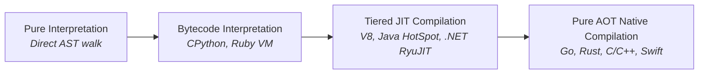

---

### AOT (Ahead-of-Time) vs. JIT (Just-in-Time)

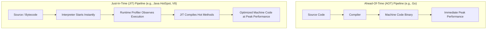

| Dimension | Ahead-of-Time (AOT) | Just-in-Time (JIT) |
| :--- | :--- | :--- |
| **When Compilation Happens** | Build time (before execution) | Runtime (during execution) |
| **Startup Latency** | ⚡ Instantaneous (pre-compiled) | ⏱️ Warmup period (interpreting + compiling) |
| **Memory Footprint** | 🟢 Lean (no runtime compiler in memory) | 🟡 Higher (stores compiler, profiling data, JIT cache) |
| **Runtime Optimization** | 🔒 Static optimizations based on code structure | 🎯 Dynamic optimizations based on **real runtime behavior** |
| **Distribution** | Architecture-specific binaries | Portable bytecode (runs on any OS with matching VM) |

---

### Speculative Optimization & Deoptimization

Modern JIT compilers (like V8 and HotSpot) use **speculative optimization**: they make optimistic bets based on runtime profiling. If an assumption is invalidated, the engine performs a **deoptimization bailout**.

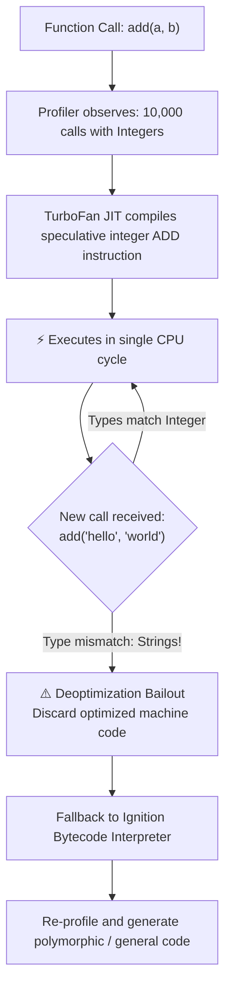

#### Code Demonstration (JavaScript Engine Perspective)

```javascript
function calculateTotal(price, tax) {
    return price + tax;
}

// 1. Warm-up phase: Engine sees only numbers
for (let i = 0; i < 50000; i++) {
    calculateTotal(100, 15); // JIT assumes: price and tax are ALWAYS integers
}

// 2. TurboFan emits raw CPU assembly: ADD eax, ebx (Zero type-checking overhead!)

// 3. Suddenly, dynamic types change:
calculateTotal("100", "$"); 

// 4. BAILOUT! The integer assumption is broken.
// The engine deoptimizes, falls back to bytecode, and handles string concatenation.
```

---

## 0.5 Key Takeaways & Study Checklist

### Core Principles

1. **Hardware is Agnostic:** CPUs only execute architecture-specific machine instructions. All programming languages are structured human abstractions.
2. **The 3-Tier Model:** Every program bridges the **Human World** $\rightarrow$ **Language / Runtime** $\rightarrow$ **Machine World**.
3. **Beyond Syntax:** True language mastery requires understanding semantics, type systems, runtime models, and memory layouts (the Iceberg model).
4. **Intermediate Representation (IR):** IR is the universal glue that allows $M$ languages to target $N$ hardware architectures cleanly without $M \times N$ compilers.
5. **Hybrid Execution:** Modern systems rarely use pure interpretation. They blend interpreters, bytecode, JIT compilers, and AOT compilation.

---

### Self-Assessment Questions

Test your understanding of Phase 0 foundations:

```text
[ ] 1. What is the difference between Lexical Analysis (Tokens) and Syntactic Analysis (AST)?
[ ] 2. Give an example of code that is syntactically valid but semantically invalid.
[ ] 3. Why do languages like Java and C# compile to an Intermediate Representation (Bytecode/CIL) instead of direct machine code?
[ ] 4. Why does an x86-64 binary compiled for Intel Core fail to run natively on an ARM64 Apple M-series chip?
[ ] 5. Explain what happens during a JIT Deoptimization (Bailout) in JavaScript engines like V8.
[ ] 6. How does Go's compilation model differ from Java's and Python's?
[ ] 7. Why is "Python is an interpreted language" an imprecise statement?
```

### The Full Picture

                    YOU
                     │
                     ↓
                 SOURCE CODE
                     │
                     ↓
                  LEXER
                     │
                     ↓
                   TOKENS
                     │
                     ↓
                  PARSER
                     │
                     ↓
                    AST
                     │
                     ↓
            SEMANTIC / TYPE ANALYSIS
                     │
                     ↓
                IR / BYTECODE
                     │
                     ↓
                OPTIMIZATION
                     │
                     ↓
             INTERPRETER / JIT / AOT
                     │
                     ↓
               MACHINE CODE
                     │
                     ↓
                OPERATING SYSTEM
                     │
             ┌───────┼────────┐
             ↓       ↓        ↓
           Memory   Disk    Network
             │
             ↓
            CPU

### Your Five-Language Mental Map

                         SOURCE
                           │
        ┌──────────────────┼──────────────────┐
        │                  │                  │
       JAVA               C#                 GO
        │                  │                  │
     Bytecode              IL              Native code
        │                  │                  │
       JVM                CLR             Go runtime
        │                  │                  │
       JIT                JIT               CPU
        │                  │
        └─────────┬────────┘
                  │
             Managed world


       PYTHON                     JS / TS
          │                          │
       Python                    TypeScript
          │                          │
       Bytecode ───────────────→ JavaScript
          │                          │
     CPython VM                  JS Engine
          │                          │
          │                    Interpreter/JIT
          │                          │
          └───────────────┬──────────┘
                          ↓
                         CPU


The Traditional Definition

Let's start with the simple model.

Compiler

A compiler generally takes a program:

SOURCE CODE
    ↓
 COMPILER
    ↓
OUTPUT PROGRAM

For example:

Go Source
    ↓
Go Compiler
    ↓
Native Executable

The compilation happens before the program runs.

Conceptually:

┌─────────────┐
│ Source Code │
└──────┬──────┘
       ↓
┌─────────────┐
│  Compiler   │
└──────┬──────┘
       ↓
┌─────────────┐
│ Machine Code│
└──────┬──────┘
       ↓
   Run Later
0.3.2 — Interpreter

An interpreter executes a program using another program.

Conceptually:

Source Code
     │
     ↓
Interpreter
     │
     ↓
Perform operations
     │
     ↓
CPU

The interpreter examines program instructions and performs the corresponding operations.

The simplified model is:

Read instruction
       ↓
Understand instruction
       ↓
Execute operation
       ↓
Read next instruction
       ↓
Repeat