# Phase 0: Polyglot Foundations — Mental Model & Execution Pipelines

> **Mastering Language Runtimes from Source Code to Silicon**  
> *A foundational guide to understanding how modern programming languages work, how computers execute code, and how different language runtimes bridge human ideas to hardware instructions.*

---

## 📑 Table of Contents

- [0.1 What is a Programming Language?](#01-what-is-a-programming-language)
  - [The Fundamental Reality](#the-fundamental-reality)
  - [The Three-Tier Architecture](#the-three-tier-architecture)
  - [The Iceberg Mental Model](#the-iceberg-mental-model)
  - [The Abstraction vs. Control Spectrum](#the-abstraction-vs-control-spectrum)
- [0.2 Universal Execution Pipeline: Source Code → Machine Execution](#02-universal-execution-pipeline-source-code--machine-execution)
  - [1. Source Code](#1-source-code)
  - [2. Lexical Analysis (Lexing & Tokens)](#2-lexical-analysis-lexing--tokens)
  - [3. Syntactic Analysis (Parsing & AST)](#3-syntactic-analysis-parsing--ast)
  - [4. Semantic Analysis & Type Checking](#4-semantic-analysis--type-checking)
  - [5. Intermediate Representation (IR / Bytecode)](#5-intermediate-representation-ir--bytecode)
  - [6. Optimization Engine](#6-optimization-engine)
  - [7. Machine Code Generation](#7-machine-code-generation)
  - [8. Target CPU Architectures (ISA)](#8-target-cpu-architectures-isa)
  - [9. Operating System & Binary Loading](#9-operating-system--binary-loading)
  - [10. Hardware Execution (CPU & Memory)](#10-hardware-execution-cpu--memory)
- [0.3 The Polyglot Pipelines Side-by-Side](#03-the-polyglot-pipelines-side-by-side)
  - [Java Pipeline (JVM)](#1-java-jvm-ecosystem)
  - [Python Pipeline (CPython)](#2-python-cpython-interpreter)
  - [JavaScript Pipeline (V8 Engine)](#3-javascript-modern-v8-engine)
  - [TypeScript Pipeline (Transpilation + Runtime)](#4-typescript-type-system--runtime)
  - [Go Pipeline (Native Toolchain)](#5-go-native-aot-toolchain)
  - [C# Pipeline (.NET CoreCLR / NativeAOT)](#6-c-net-ecosystem)
  - [Comparative Pipeline Matrix](#polyglot-runtime-comparison-matrix)
- [0.4 Dispelling the Myth: "Compiled vs. Interpreted" is Not a Binary](#04-dispelling-the-myth-compiled-vs-interpreted-is-not-a-binary)
  - [The Modern Execution Spectrum](#the-modern-execution-spectrum)
  - [AOT (Ahead-of-Time) vs. JIT (Just-in-Time)](#aot-ahead-of-time-vs-jit-just-in-time)
  - [Speculative Optimization & Deoptimization](#speculative-optimization--deoptimization)
- [0.5 Polyglot Execution Synthesis & Study Guide](#05-polyglot-execution-synthesis--study-guide)
  - [The Universal Pipeline & Mental Map](#the-universal-pipeline--mental-map)
  - [The Three Transformation Archetypes](#the-three-transformation-archetypes)
  - [Startup Latency vs. Steady-State Performance](#startup-latency-vs-steady-state-performance)
  - [Rapid-Fire FAQ: "Is X Compiled or Interpreted?"](#rapid-fire-faq-is-x-compiled-or-interpreted)
  - [Polyglot Master Comparison Matrix](#polyglot-master-comparison-matrix)
  - [Core Principles & Self-Assessment](#core-principles--self-assessment)
- [0.6 Deep Dive: Virtual Machines, IR, & Runtime Mechanics](#06-deep-dive-virtual-machines-ir--runtime-mechanics)
  - [1. What Is Bytecode?](#1-what-is-bytecode)
  - [2. The JVM as a Virtual Machine: Virtual vs. Physical CPU](#2-the-jvm-as-a-virtual-machine-virtual-vs-physical-cpu)
  - [3. VM Architectures: Stack-Based vs. Register-Based](#3-vm-architectures-stack-based-vs-register-based)
  - [4. Intermediate Representation (IR) & The M×N Problem](#4-intermediate-representation-ir--the-m--n-problem)
  - [5. The Multi-Stage Compilation Pipeline](#5-the-multi-stage-compilation-pipeline)
  - [6. Interpreter Internals: The Fetch–Decode–Execute Loop](#6-interpreter-internals-the-fetchdecodeexecute-loop)
  - [7. Runtime Profiling & JIT Hotspot Detection](#7-runtime-profiling--jit-hotspot-detection)
  - [8. Native Runtimes: Why Go Has a Runtime](#8-native-runtimes-why-go-has-a-runtime)
  - [9. The Full Universal Execution Model](#9-the-full-universal-execution-model)
  - [10. Master Polyglot Comparison Table](#10-master-polyglot-comparison-table)
- [0.7 Deep Dive: Type Systems, Typing Paradigms, & Runtime Mechanics](#07-deep-dive-type-systems-typing-paradigms--runtime-mechanics)
  - [1. Static vs. Dynamic vs. Gradual Typing](#1-static-vs-dynamic-vs-gradual-typing)
  - [2. Trade-offs: When Static vs. Dynamic Helps Most](#2-trade-offs-when-static-vs-dynamic-helps-most)
  - [3. Type Safety, Coercion, & Explicit Conversions](#3-type-safety-coercion--explicit-conversions)
  - [4. Generics: Parameterizing Code with Types](#4-generics-parameterizing-code-with-types)
  - [5. Compile-Time vs. Runtime: The Separation of Worlds](#5-compile-time-vs-runtime-the-separation-of-worlds)
  - [6. Master Polyglot Type System Comparison Matrix](#6-master-polyglot-type-system-comparison-matrix)

---

## 0.1 What is a Programming Language?

### The Fundamental Reality

A central truth of computer systems is simple:

> [!IMPORTANT]
> **The CPU does not understand Java, Python, JavaScript, TypeScript, Go, or C#.**  
> The CPU is physical silicon with logic gates, registers, and memory buses. It only understands **machine instructions**—streams of binary numbers encoding specific hardware operations.

```
+-------------------------------------------------------------------------------+
|                                  HARDWARE                                     |
|  Does NOT understand:  Java | Python | JavaScript | TypeScript | Go | C#      |
|  ONLY understands:     Opcode bit patterns (e.g., 01001000 10001001 11000011) |
+-------------------------------------------------------------------------------+
```

If we had to instruct the CPU manually, every single operation would require explicit hardware-level commands:

```text
Load memory address 0x7FFF50 into register RAX
Move value 42 into register RBX
Compare RAX and RBX bits
Jump to instruction offset +0x14 if equal
Store RAX into memory buffer address 0x7FFF58
```

Programming languages provide **abstractions** that allow human engineers to express computational intent in expressive, structured formats, while compilers and runtimes translate that intent into machine execution.

---

### The Three-Tier Architecture

Every modern software system operates across three primary layers:

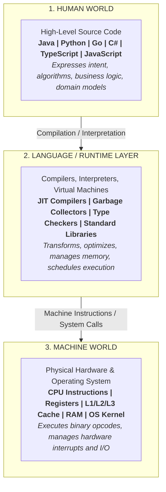

```
┌─────────────────────────────────────────────────────────┐
│                      HUMAN WORLD                        │
│             Java / Python / Go / C# / TS / JS           │
└────────────────────────────┬────────────────────────────┘
                             │  Source Code
                             ▼
┌─────────────────────────────────────────────────────────┐
│                 LANGUAGE & RUNTIME LAYER                │
│    Compiler / Interpreter / VM / JIT / GC / Stdlib      │
└────────────────────────────┬────────────────────────────┘
                             │  Machine Instructions
                             ▼
┌─────────────────────────────────────────────────────────┐
│                      MACHINE WORLD                      │
│     CPU Registers / ALU / Memory / OS Kernel / Silicon  │
└─────────────────────────────────────────────────────────┘
```

---

### The Iceberg Mental Model

What most developers see is only the tip of the programming language iceberg—the syntax. However, true software engineering requires understanding every layer underneath:

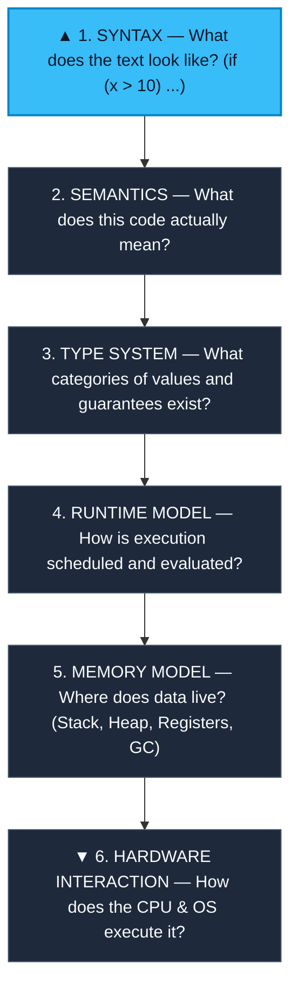

```text
                       ▲
                      / \
                     /   \
                    / CODE\
                   /───────\
                  │ SYNTAX  │  <-- Only ~10% visible (Keywords, brackets, symbols)
       ~~~~~~~~~~~│~~~~~~~~~│~~~~~~~~~~~~~~~~~~~~~~~~~~~~~~~~~~~~~~~~~~~~~~~~~~~~~
                  │SEMANTICS│  <-- What operations and behaviors are meant?
                  ├─────────┤
                  │  TYPES  │  <-- Static vs Dynamic, Strong vs Weak, Memory sizes
                  ├─────────┤
                  │ RUNTIME │  <-- Event loops, Thread pools, Goroutine schedulers
                  ├─────────┤
                  │ MEMORY  │  <-- Stack vs Heap, GC roots, Pointer semantics
                  ├─────────┤
                  │HARDWARE │  <-- Registers, Cache lines, CPU Pipeline, OS Kernel
                  └─────────┘
```

> [!TIP]
> **Key Philosophy:** Learning a new language does not mean memorizing new syntax rules. It means understanding its **computational model**, **memory layout**, and **runtime execution strategy**.

---

### The Abstraction vs. Control Spectrum

Every programming language makes fundamental trade-offs between **developer ergonomics (abstraction)** and **bare-metal efficiency (control)**:

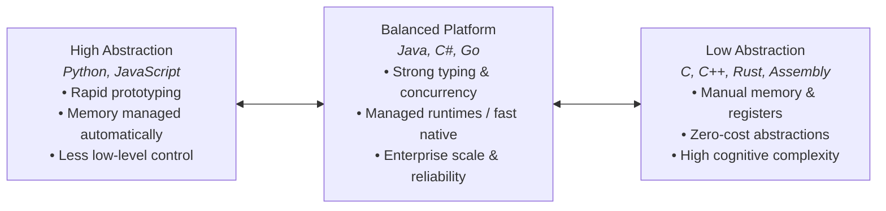

| Trait | High Abstraction (e.g., Python, JS) | Balanced Runtime (e.g., Go, Java, C#) | Low Abstraction (e.g., C, Rust, Zig) |
| :--- | :--- | :--- | :--- |
| **Development Speed** | ⚡ Very Fast | 🚀 Fast to Moderate | ⏱️ Slower / Methodical |
| **Direct Hardware Control** | ❌ Minimal | ⚠️ Moderate / Constrained | ✅ Direct & Total |
| **Memory Management** | 🔄 Automatic (GC / RefCount) | 🔄 Automatic (GC / Tracing) | 🛠️ Manual / Compile-time Ownership |
| **Cognitive Overhead** | 🟢 Low | 🟡 Medium | 🔴 High |
| **Peak Predictability** | ⚠️ Runtime JIT / GC pauses | ⚡ Highly optimized | 🎯 Deterministic cycle-level control |

---

## 0.2 Universal Execution Pipeline: Source Code → Machine Execution

How does human-written source code actually become electric charges firing through a processor? The transformation follows an engineering pipeline composed of **10 critical stages**:

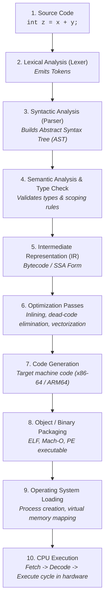

---

### 1. Source Code

Source code is merely a plain-text file containing UTF-8 or ASCII characters:

```c
int z = x + y;
```

At this initial stage, the computer sees only raw character byte values:
`['i', 'n', 't', ' ', 'z', ' ', '=', ' ', 'x', ' ', '+', ' ', 'y', ';']`.

---

### 2. Lexical Analysis (Lexing & Tokens)

The **Lexer** (or Tokenizer) scans the character stream and categorizes characters into structured lexical units called **Tokens**, stripping out meaningless whitespace and comments.

```text
Raw Text: "int z = x + y;"
   │
   ▼
[KEYWORD: "int"]  [IDENTIFIER: "z"]  [OPERATOR: "="]  [IDENTIFIER: "x"]  [OPERATOR: "+"]  [IDENTIFIER: "y"]  [SEMICOLON: ";"]
```

---

### 3. Syntactic Analysis (Parsing & AST)

The **Parser** takes the stream of tokens and evaluates them against the formal grammar of the language. If valid, it produces an **Abstract Syntax Tree (AST)** that reflects the structural hierarchy of the operation.

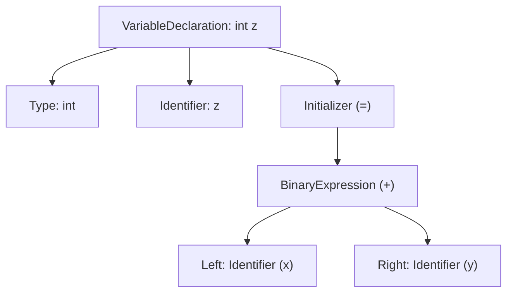

```text
VariableDeclaration
 ├── Type: int
 ├── Name: z
 └── Initializer: Assignment (=)
      └── BinaryExpression (+)
           ├── LeftOperand: Identifier (x)
           └── RightOperand: Identifier (y)
```

> [!NOTE]
> **Syntax Errors** occur here. If you write `int z = + ;`, the lexer recognizes valid tokens, but the parser fails because the sequence violates grammar rules.

---

### 4. Semantic Analysis & Type Checking

Semantic analysis verifies whether a syntactically correct program actually makes logical sense according to language rules:

- **Scope checking:** Have variables `x` and `y` been declared in accessible scopes?
- **Type checking:** Can `x` and `y` be added together? Can the result be stored in an `int`?
- **Mutability & Constness:** Is a `const` or `final` variable being illegally modified?

```text
Syntax Check:    "Is this sentence grammatically valid?"
Semantic Check:  "Does this statement make sense in our universe?"
```

For example:
```typescript
let name: string = "Alice";
let count: number = 42;
let result = name - count; // Syntax is valid, but Semantic Check fails: Operator '-' cannot be applied to 'string' and 'number'.
```

---

### 5. Intermediate Representation (IR / Bytecode)

Once verified, the compiler transforms the AST into an **Intermediate Representation (IR)** or **Bytecode**. IR is an abstract, machine-independent instruction format.

```text
; Conceptual 3-Address Code IR
t0 = LOAD x
t1 = LOAD y
t2 = ADD t0, t1
STORE t2, z
```

#### Why Not Go Directly from Source Code to Machine Code?

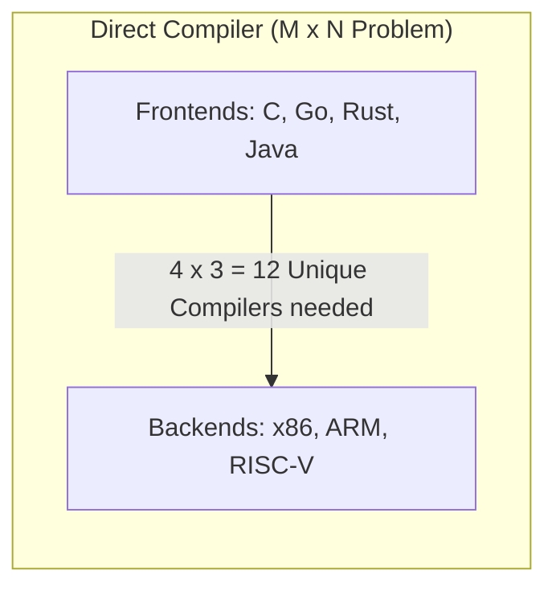

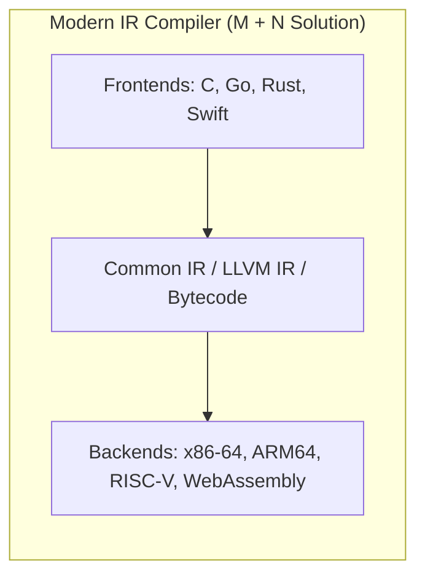

By decoupling the human-facing language frontend from the hardware backend through a shared IR:
1. **Adding a new language** only requires 1 new frontend (translating Source → IR).
2. **Adding a new CPU architecture** only requires 1 new backend (translating IR → Machine Code).
3. Optimization algorithms written for the IR automatically benefit all supported languages.

---

### 6. Optimization Engine

The optimizer transforms the IR to make the program execute faster, occupy less memory, and consume less power without altering observable behavior:

- **Constant Folding:** `int seconds = 60 * 60 * 24;` $\rightarrow$ `int seconds = 86400;`
- **Dead Code Elimination:** Removing `if (false)` blocks and unreachable functions.
- **Function Inlining:** Replacing small function calls with their bodies to eliminate call-stack overhead.
- **Loop Unrolling & Vectorization:** Utilizing SIMD (Single Instruction, Multiple Data) CPU registers.

---

### 7. Machine Code Generation

The compiler backend translates the optimized IR into raw machine code instructions specific to the target architecture's Instruction Set Architecture (ISA):

```nasm
; Conceptual x86-64 Assembly
mov eax, DWORD PTR [rbp-4]    ; Load x into register EAX
add eax, DWORD PTR [rbp-8]    ; Add y to EAX
mov DWORD PTR [rbp-12], eax   ; Store result into z
```

In binary representation:
```text
8B 45 FC       (mov eax, [rbp-4])
03 45 F8       (add eax, [rbp-8])
89 45 F4       (mov [rbp-12], eax)
```

---

### 8. Target CPU Architectures (ISA)

A binary compiled for one architecture cannot run on a different architecture because each processor family has its own Instruction Set Architecture (ISA):

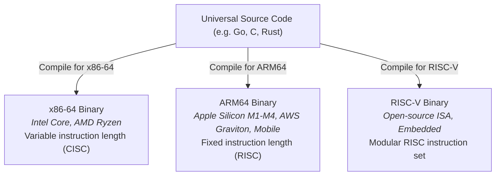

---

### 9. Operating System & Binary Loading

When you run an executable binary (`./app` or `app.exe`), the OS kernel takes charge:
1. **Binary Loader:** Reads the executable file format (**ELF** on Linux, **Mach-O** on macOS, **PE** on Windows).
2. **Virtual Memory Mapping:** Maps code sections (`.text`), read-only data (`.rodata`), and allocates initial Stack and Heap pages.
3. **Dynamic Linking:** Loads required shared libraries (`libc.so`, `kernel32.dll`, `libSystem.dylib`).
4. **Instruction Pointer Init:** Sets the CPU's Program Counter (PC / RIP) to the application entry point (`_start` $\rightarrow$ `main`).

---

### 10. Hardware Execution (CPU & Memory)

The CPU executes instructions via the classic **Instruction Cycle**:

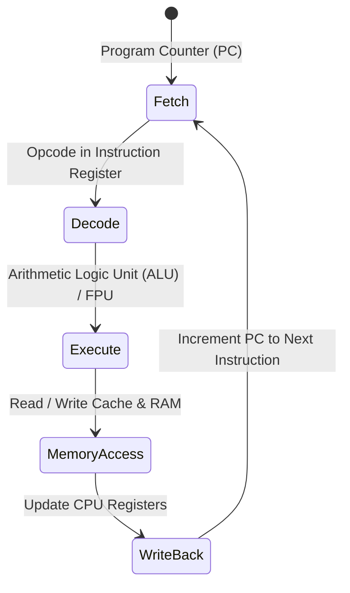

---

## 0.3 The Polyglot Pipelines Side-by-Side

Every major language ecosystem adopts a distinct path along this pipeline. Below are the 6 foundational languages compared directly.

```mermaid
flowchart LR
    subgraph JavaFlow["☕ Java"]
        J1[".java"] --> J2["javac"] --> J3[".class Bytecode"] --> J4["JVM (HotSpot)"] --> J5["JIT (C1/C2)"] --> J6["CPU"]
    end
    subgraph PythonFlow["🐍 Python"]
        P1[".py"] --> P2["CPython Parser"] --> P3[".pyc Bytecode"] --> P4["CPython VM (Eval Loop)"] --> P5["C Runtime Execution"] --> P6["CPU"]
    end
    subgraph JSFlow["🟨 JavaScript"]
        JS1[".js"] --> JS2["V8 Parser"] --> JS3["Ignition Bytecode"] --> JS4["TurboFan JIT"] --> JS5["Machine Code"] --> JS6["CPU"]
    end
    subgraph TSFlow["🔷 TypeScript"]
        TS1[".ts"] --> TS2["tsc Type Check"] --> TS3["Transpiled .js"] --> TS4["JS Engine"] --> TS5["JIT / Interpreter"] --> TS6["CPU"]
    end
    subgraph GoFlow["🔵 Go"]
        G1[".go"] --> G2["Go Compiler (gc)"] --> G3["SSA Optimization"] --> G4["Native Machine Code"] --> G5["OS Binary"] --> G6["CPU"]
    end
    subgraph CSharpFlow["🟣 C#"]
        C1[".cs"] --> C2["Roslyn Compiler"] --> C3["CIL / MSIL Bytecode"] --> C4[".NET CoreCLR"] --> C5["RyuJIT / NativeAOT"] --> C6["CPU"]
    end
```

---

### 1. Java (JVM Ecosystem)

```
Java Source (.java)
       │
       ▼  [javac Compiler]
JVM Bytecode (.class / .jar)
       │
       ▼  [Java Virtual Machine (HotSpot)]
 ┌───────────────────────────────┐
 │ • Interpreter (Zero warmup)   │
 │ • Tier 1 JIT (C1 Compiler)    │
 │ • Tier 2 JIT (C2 Compiler)    │
 │ • Garbage Collector (G1/ZGC)  │
 └───────────────┬───────────────┘
                 │
                 ▼
     Native Machine Code ──▶ CPU
```

- **Philosophy:** *"Write Once, Run Anywhere"* (WORA).
- **Core Mechanism:** `javac` produces portable bytecode. At runtime, the JVM starts interpreting immediately, profiles hot code paths, and JIT-compiles frequently executed methods into machine code.

---

### 2. Python (CPython Interpreter)

```
Python Source (.py)
       │
       ▼  [CPython Compiler]
Bytecode (.pyc / __pycache__)
       │
       ▼  [CPython Virtual Machine]
 ┌───────────────────────────────┐
 │ • C-based Evaluation Loop     │
 │   (ceval.c / bytecode dispatch)│
 │ • Reference Counting + CycleGC│
 │ • GIL (Global Interpreter Lock│
 └───────────────┬───────────────┘
                 │
                 ▼
      Direct C/OS Calls ──▶ CPU
```

- **Philosophy:** Developer velocity, clarity, and vast ecosystem integration.
- **Core Mechanism:** Standard CPython compiles source to bytecode on the fly and interprets it via a large `switch` loop written in C. Python delegates performance-heavy tasks to C/C++/Rust extensions (e.g., NumPy, PyTorch).

---

### 3. JavaScript (Modern V8 Engine)

```
JavaScript Source (.js)
       │
       ▼  [V8 Parser & AST]
Ignition Bytecode
       │
       ▼  [V8 Ignition Interpreter]
Profiler (Watches Hot Functions & Types)
       │
       ▼  [TurboFan Optimizing JIT]
Optimized Native Machine Code
       │ (If type assumption fails)
       ▼
Deoptimization (Bailout back to Ignition Bytecode)
```

- **Philosophy:** Instant execution on the web, dynamic flexibility, high peak performance.
- **Core Mechanism:** V8 starts execution instantly using the **Ignition** bytecode interpreter. When a function runs repeatedly with consistent data types, **TurboFan** JIT-compiles it directly into machine code.

---

### 4. TypeScript (Type System + Runtime)

```
TypeScript Source (.ts)
       │
       ▼  [tsc / esbuild / SWC]
Type Check (Static Analysis)  ──▶  (Strip types & transpile)
       │
       ▼
JavaScript Code (.js)
       │
       ▼
Standard JavaScript Engine (V8 / JavaScriptCore / SpiderMonkey)
       │
       ▼
JIT / Bytecode Execution ──▶ CPU
```

- **Philosophy:** Type safety and scalable developer ergonomics during development, with standard JavaScript ubiquity at runtime.
- **Core Mechanism:** TypeScript types exist **only at compile time**. The transpiler strips away all types, leaving standard JavaScript to run in Node.js, Bun, Deno, or browsers.

---

### 5. Go (Native AOT Toolchain)

```
Go Source (.go)
       │
       ▼  [Go Toolchain: gc compiler]
Frontend Parsing & Type Checking
       │
       ▼  [Static Single Assignment (SSA) IR]
SSA Optimizations & Inlining
       │
       ▼  [Code Generator & Linker]
Single Statically-Linked Native Binary (ELF / Mach-O / PE)
       │ (Includes minimal Go Runtime: GC + Goroutine M:N Scheduler)
       ▼
Operating System ──▶ CPU
```

- **Philosophy:** Simplicity, blazingly fast compilation, native execution, built-in concurrency.
- **Core Mechanism:** Go compiles directly to machine code ahead of time. It produces a standalone binary that includes its own lightweight runtime (Goroutine scheduler and garbage collector) without needing an external VM installed.

---

### 6. C# (.NET Ecosystem)

```
C# Source (.cs)
       │
       ▼  [Roslyn Compiler]
Common Intermediate Language (CIL / MSIL (.dll / .exe))
       │
       ▼  [.NET CoreCLR Runtime]
 ┌──────────────────────────────────────┐
 │ • Tiered RyuJIT Compiler             │
 │ • Generational Garbage Collector     │
 │ • (Or NativeAOT Direct Compilation)  │
 └──────────────────┬───────────────────┘
                    │
                    ▼
        Native Machine Code ──▶ CPU
```

- **Philosophy:** High-performance managed platform, modern type systems, game engines (Unity), cloud backends.
- **Core Mechanism:** Roslyn translates C# to CIL bytecode. At startup, the CoreCLR runtime uses **RyuJIT** to compile CIL into machine code, or can compile directly to native binaries using **NativeAOT**.

---

### Polyglot Runtime Comparison Matrix

| Feature / Dimension | **Java** | **Python** | **JavaScript** | **TypeScript** | **Go** | **C#** |
| :--- | :--- | :--- | :--- | :--- | :--- | :--- |
| **Primary Paradigm** | Multi-paradigm (OOP focus) | Multi-paradigm (Dynamic) | Multi-paradigm (Prototype/Event) | Static Typed JS | Concurrent / Imperative | Multi-paradigm (OOP/Functional) |
| **Intermediate Format** | JVM Bytecode (`.class`) | CPython Bytecode (`.pyc`) | V8 Bytecode (Ignition) | N/A (Emits JS) | SSA IR (Internal) | CIL / MSIL (`.dll`) |
| **Execution Engine** | JVM (HotSpot, OpenJ9) | CPython VM | V8, SpiderMonkey, JSC | Host JS Engine | Direct OS Kernel | .NET CoreCLR |
| **Compilation Strategy** | Mixed (Bytecode + Tiered JIT) | Interpreted Bytecode | Tiered JIT (Interpreter + JIT) | Transpiled to JS | Pure AOT (Native Machine Code) | Tiered JIT / NativeAOT |
| **Memory Management** | Automatic (Tracing GC) | Automatic (Ref Count + Cycle GC) | Automatic (Generational GC) | Handled by JS Engine | Automatic (Concurrent Tri-color GC) | Automatic (Generational GC) |
| **Primary Domain** | High-scale Enterprise, Backend, Distributed Systems | AI/ML, Data Science, Scripting, Automation | Web Frontend, APIs, Fullstack | Enterprise Web, Type-safe Backends | Cloud Infra, Microservices, Networking | Enterprise Backend, Game Dev (Unity), Cloud |

---

## 0.4 Dispelling the Myth: "Compiled vs. Interpreted" is Not a Binary

### The Modern Execution Spectrum

A common beginner misconception is treating languages as strictly *compiled* or *interpreted*:

```text
❌ FLAWED VIEW:
Compiled Languages:     [ C, C++, Rust, Go ]
Interpreted Languages:  [ Python, JavaScript, Ruby, PHP ]
```

> [!WARNING]
> **Compilation and Interpretation are properties of the *implementation*, not the *language itself*.**  
> You can write a C interpreter (e.g., Cling, Ch) or a Python ahead-of-time compiler (e.g., Cython, Nuitka, PyPy JIT).

In modern computing, execution exists on a continuous hybrid spectrum:

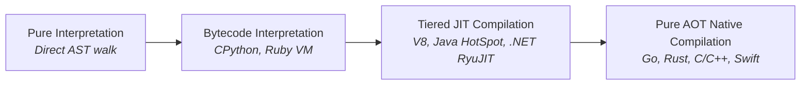

---

### AOT (Ahead-of-Time) vs. JIT (Just-in-Time)

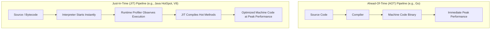

| Dimension | Ahead-of-Time (AOT) | Just-in-Time (JIT) |
| :--- | :--- | :--- |
| **When Compilation Happens** | Build time (before execution) | Runtime (during execution) |
| **Startup Latency** | ⚡ Instantaneous (pre-compiled) | ⏱️ Warmup period (interpreting + compiling) |
| **Memory Footprint** | 🟢 Lean (no runtime compiler in memory) | 🟡 Higher (stores compiler, profiling data, JIT cache) |
| **Runtime Optimization** | 🔒 Static optimizations based on code structure | 🎯 Dynamic optimizations based on **real runtime behavior** |
| **Distribution** | Architecture-specific binaries | Portable bytecode (runs on any OS with matching VM) |

---

### Speculative Optimization & Deoptimization

Modern JIT compilers (like V8 and HotSpot) use **speculative optimization**: they make optimistic bets based on runtime profiling. If an assumption is invalidated, the engine performs a **deoptimization bailout**.

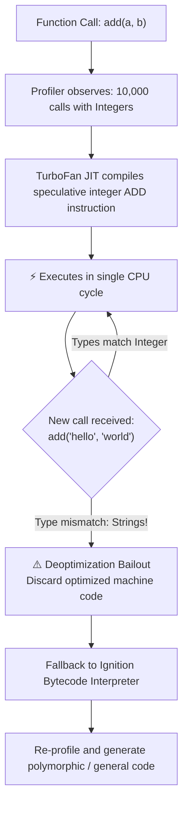

#### Code Demonstration (JavaScript Engine Perspective)

```javascript
function calculateTotal(price, tax) {
    return price + tax;
}

// 1. Warm-up phase: Engine sees only numbers
for (let i = 0; i < 50000; i++) {
    calculateTotal(100, 15); // JIT assumes: price and tax are ALWAYS integers
}

// 2. TurboFan emits raw CPU assembly: ADD eax, ebx (Zero type-checking overhead!)

// 3. Suddenly, dynamic types change:
calculateTotal("100", "$"); 

// 4. BAILOUT! The integer assumption is broken.
// The engine deoptimizes, falls back to bytecode, and handles string concatenation.
```

---

## 0.5 Polyglot Execution Synthesis & Study Guide

### The Universal Pipeline & Mental Map

```text
       ┌───────────┐     ┌───────┐     ┌────────┐     ┌───────────┐     ┌──────────────┐     ┌──────────────┐     ┌─────────┐
YOU ──▶│Source Code│────▶│ Lexer │────▶│ Parser │────▶│ Semantic  │────▶│ Intermediate │────▶│ Optimization │────▶│ Machine │
       │  (Text)   │     │(Tokens│     │ (AST)  │     │ Analysis  │     │Representation│     │(DeadCode/SIMD│     │  Code   │
       └───────────┘     └───────┘     └────────┘     └───────────┘     └──────────────┘     └──────────────┘     └────┬────┘
                                                                                                                       │
                                               ┌───────────────────────────────────────────────────────────────────────┘
                                               ▼
                                      ┌─────────────────┐
                                      │ Operating System│ ──▶ [Memory / Stack / Heap] ──▶ ⚡ CPU Execution
                                      └─────────────────┘
```

#### The Polyglot Architecture Map

```text
                              ┌──────────────── SOURCE CODE ────────────────┐
                              │                                              │
                 ┌────────────┴────────────┐                    ┌────────────┴────────────┐
                 ▼                         ▼                    ▼                         ▼
             [ STATIC ]               [ MANAGED ]          [ DYNAMIC ]               [ SCRIPT ]
                 │                         │                    │                         │
                 Go                    Java / C#             JS (V8)                    Python
                 │                         │                    │                         │
            gc Compiler            javac / Roslyn           V8 Parser                CPython Parser
                 │                         │                    │                         │
            Direct AOT             Bytecode / CIL        Ignition Bytecode          Bytecode (.pyc)
                 │                         │                    │                         │
           Native Binary               JVM / CLR           TurboFan JIT              CPython VM
                 │                         │                    │                         │
                 ▼                         ▼                    ▼                         ▼
            ┌─────────┐               ┌─────────┐          ┌─────────┐               ┌─────────┐
            │   OS    │               │ JIT/AOT │          │ De-Opt  │               │ C-Loop  │
            └────┬────┘               └────┬────┘          └────┬────┘               └────┬────┘
                 │                         │                    │                         │
                 └─────────────────────────┴─────────┬──────────┴─────────────────────────┘
                                                     ▼
                                            ⚡ PHYSICAL CPU
```

---

### The Three Transformation Archetypes

Modern programming languages generally fit into one of three core compilation and execution models:

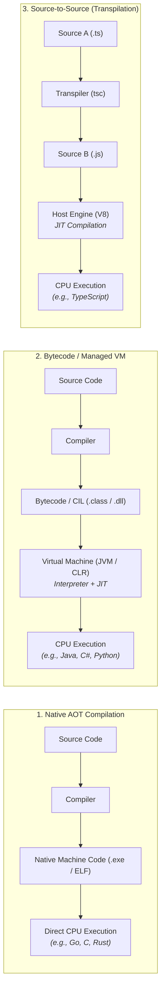

---

### Startup Latency vs. Steady-State Performance

When choosing an execution model for production, understand the fundamental trade-off between **instant startup** and **dynamic optimization throughput**:

```text
PERFORMANCE ▲
            │
  High JIT  │                                     ╭────────────────── (Peak Optimized JIT Throughput)
  Steady    │                                ╭────╯
  State     │                           ╭────╯
            │   ───────────────────────╯............................ (AOT Deterministic Flatline)
   AOT Fast │  /
    Startup │ /
   Baseline │/
            └────────────────────────────────────────────────────────▶ TIME / EXECUTION LOOPS
            0 (Startup)              Warmup Phase                  Steady-State Production
```

- **Ahead-Of-Time (AOT — Go):** Starts instantly at 100% capacity with predictable low memory; cannot optimize using dynamic runtime information.
- **Just-In-Time (JIT — Java HotSpot, V8, .NET):** Requires an initial warm-up period while profiling execution, but can generate aggressively specialized machine code for hot execution loops.

---

### Rapid-Fire FAQ: "Is X Compiled or Interpreted?"

| Language | The Engineering Reality |
| :--- | :--- |
| **☕ Java** | **Hybrid:** Source is compiled ahead-of-time by `javac` into `.class` bytecode, which the JVM executes via a multi-tiered combination of an interpreter and JIT compilers (C1 & C2). |
| **🐍 Python** | **Bytecode-Interpreted:** CPython compiles `.py` source on the fly to `.pyc` bytecode, then executes it in a C-based evaluation loop (`ceval.c`). Heavy computation is delegated to native C/C++/Rust extensions. |
| **🟨 JavaScript** | **Tiered JIT:** Modern JS engines (V8, SpiderMonkey) compile source to internal bytecode on launch (Ignition) and continuously optimize hot execution paths into native machine code (TurboFan) with speculative bailouts. |
| **🔷 TypeScript** | **Transpiled:** TypeScript is purely a static type layer. `tsc` verifies types and strips them away to emit plain JavaScript, which is then executed by a standard JS engine. |
| **🔵 Go** | **Pure Native AOT:** Compiled directly into standalone machine code binaries with an embedded, lightweight concurrent runtime (Goroutine scheduler + GC). No external VM required. |
| **🟣 C#** | **Managed Bytecode + Dual-Engine:** Roslyn compiles C# to Common Intermediate Language (CIL). .NET CoreCLR uses **RyuJIT** for dynamic runtime compilation or **NativeAOT** for direct standalone binaries. |

---

### Polyglot Master Comparison Matrix

| Technical Metric | ☕ Java | 🐍 Python | 🟨 JavaScript | 🔷 TypeScript | 🔵 Go | 🟣 C# |
| :--- | :--- | :--- | :--- | :--- | :--- | :--- |
| **Source Transformed Pre-Run?** | ✅ Yes (`javac`) | ✅ Yes (On-fly `.pyc`) | ⚡ Internal Engine | ✅ Yes (`tsc` $\rightarrow$ JS) | ✅ Yes (`go build`) | ✅ Yes (`dotnet build`) |
| **Intermediate Representation** | JVM Bytecode | CPython Bytecode | Ignition Bytecode | Emits JavaScript | Compiler SSA IR | CIL / MSIL (`.dll`) |
| **Host Runtime / VM** | JVM (HotSpot) | CPython VM | V8 / JavaScriptCore | Host JS Engine | Embedded Go Runtime | .NET CoreCLR |
| **JIT Optimization?** | ✅ Multi-tiered JIT | ❌ Standard CPython (PyPy: Yes) | ✅ Speculative JIT | ⚡ Via JS Host Engine | ❌ Pure AOT Model | ✅ Tiered RyuJIT |
| **Pre-execution Native Binary?** | ⚠️ GraalVM Native | ❌ No | ❌ No | ❌ No | ✅ Yes (Statically linked) | ⚠️ RyuJIT (or NativeAOT) |
| **Garbage Collector (GC)** | ✅ Tracing (G1, ZGC) | ✅ RefCount + Cycle GC | ✅ Generational GC | ✅ Managed by Host JS | ✅ Concurrent Tri-color | ✅ Generational GC |
| **Primary Domain** | Enterprise Backend | AI/ML, Automation | Web & Fullstack | Scalable Web / Node | Cloud Infrastructure | Enterprise & Game Dev |

---

### Core Principles & Self-Assessment

#### 🧠 5 Immutable Engineering Rules
1. **The CPU is Dumb & Fast:** It understands zero high-level syntax—only opcodes and memory offsets.
2. **The 3-Tier Bridge:** Code always maps from **Human Intent** $\rightarrow$ **Language/Runtime Machine** $\rightarrow$ **Physical Silicon**.
3. **Beyond Syntax:** Mastering a language means mastering its computational model, type system, runtime, and memory behavior.
4. **Intermediate Representation is King:** IR decoupling eliminates the $M \times N$ compilation explosion.
5. **No False Dichotomy:** Modern languages blend interpreters, bytecode, JIT profiling, and AOT compilation.

#### 📝 Self-Assessment Review
```text
[ ] 1. Explain why 'int z = + ;' fails during parsing, whereas 'let x: string = 10 - 2;' fails during semantic analysis.
[ ] 2. How does an Intermediate Representation (IR) enable LLVM to support multiple languages and multiple CPU chips?
[ ] 3. Describe the tradeoff between Go's instant AOT startup and Java's steady-state HotSpot JIT performance.
[ ] 4. What happens under the hood when a JavaScript engine triggers a 'deoptimization bailout'?
[ ] 5. Why does Go have an embedded runtime even though it compiles to a native standalone executable?
```
---

## 0.6 Deep Dive: Virtual Machines, IR, & Runtime Mechanics

### 1. What Is Bytecode?
**Bytecode** is an intermediate, platform-independent instruction set designed for execution by a language runtime or virtual machine (VM) rather than physical silicon. It serves as **instructions for a virtual execution environment**.

#### System VM vs. Language VM: The Correct Mental Model
| Dimension | 🖥️ System Virtual Machine | ☕ Language Virtual Machine |
| :--- | :--- | :--- |
| **Core Purpose** | Virtualizes/emulates an entire physical computer | Virtualizes an execution environment for a specific language |
| **Abstraction Level** | Hardware (CPU, Memory, Devices) & Virtual Guest OS | Bytecode instruction set, virtual stack/registers, & managed runtime |
| **Execution Flow** | Hardware $\rightarrow$ Hypervisor $\rightarrow$ VM $\rightarrow$ Virtual OS $\rightarrow$ Apps | Source $\rightarrow$ Bytecode $\rightarrow$ Language VM $\rightarrow$ Native CPU Opcodes |
| **Examples** | VMware, VirtualBox, Cloud VMs (AWS EC2, GCP, Azure) | JVM (Java), CLR (C#/.NET), CPython VM (Python), V8 (JavaScript) |

> [!NOTE]
> **Key Distinctions:** A **System VM** virtualizes a *computer* (hardware + OS). A **Language VM** virtualizes an *execution environment*. A language VM (like the JVM) is **not** an entire virtual operating system.

---

### 2. The JVM as a Virtual Machine: Virtual vs. Physical CPU
Just as a physical CPU understands hardware opcodes, the JVM functions as a **virtual CPU** with its own standardized instruction set:

```text
┌──────────────────────────────────────┐     ┌──────────────────────────────────────┐
│       PHYSICAL CPU (Hardware)        │     │         VIRTUAL CPU (JVM)            │
├──────────────────────────────────────┤     ├──────────────────────────────────────┤
│ Instructions: ADD, MOV, JMP, CMP     │     │ Instructions: iload, iadd, istore,   │
│ Target: x86_64, ARM64, RISC-V        │     │               invoke, return         │
└──────────────────────────────────────┘     └──────────────────────────────────────┘
```

```text
Java Source (.java) ──▶ Java Bytecode (.class) ──▶ JVM (Translates/Executes) ──▶ Native CPU Operations
```
- **Portability:** Java bytecode is 100% platform-independent ("Write Once, Run Anywhere").
- **Platform Isolation:** The platform-specific JVM binary translates virtual instructions into the host CPU's native instruction set.

---

### 3. VM Architectures: Stack-Based vs. Register-Based
Language virtual machines typically adopt one of two computational models:

```text
STACK-BASED VM (e.g., JVM, CPython, WASM, CLR)     REGISTER-BASED VM (e.g., LuaJIT, Dalvik/ART)
──────────────────────────────────────────────     ────────────────────────────────────────────
Execution Example (10 + 20):                       Execution Example (10 + 20):
  PUSH 10   ──▶ Stack: [10]                          LOAD R1, 10
  PUSH 20   ──▶ Stack: [10, 20]                      LOAD R2, 20
  ADD       ──▶ Pops 10 & 20, pushes [30]            ADD  R3, R1, R2

• Implicit storage on an evaluation stack          • Explicit storage locations (virtual registers)
• Compact bytecode; simpler compiler code-gen      • Fewer instructions dispatched; closer to real CPUs
```

---

### 4. Intermediate Representation (IR) & The $M \times N$ Problem
An **Intermediate Representation (IR)** is a universal, compiler-internal format between source code and machine code (`Source Code` $\rightarrow$ `IR` $\rightarrow$ `Machine Code`).

```text
WITHOUT IR (Direct M × N Matrix):                  WITH A COMMON IR (M + N Decoupling):
Java   ──┬──▶ x86                                  Java   ──┐                  ┌──▶ x86
         └──▶ ARM                                  Python ──┤                  ├──▶ ARM
Python ──┬──▶ x86      Requires                    JS     ──┼──▶ [ COMMON IR ] ┼──▶ Apple Silicon
         └──▶ ARM   M × N Compilers                Go     ──┤     (e.g., LLVM) └──▶ RISC-V
Go     ──┬──▶ x86                                  C#     ──┘                  Requires M + N
         └──▶ ARM                                                              Frontends & Backends
```
*Decoupling frontends from backends eliminates compiler duplication and allows optimizations to be shared across all languages.*

---

### 5. The Multi-Stage Compilation Pipeline
> [!IMPORTANT]
> **Compilation is a pipeline, not a single magical operation.**  
> Rather than a black-box transformation (`Source` $\rightarrow$ `Executable`), modern compilers process code through distinct, verifiable stages:

```text
Source Code ──▶ [ 1. Lexical Analysis ]   ──▶ Tokens
            ──▶ [ 2. Parsing / Syntax ]   ──▶ Abstract Syntax Tree (AST)
            ──▶ [ 3. Semantic Analysis ]  ──▶ Type-Checked AST & Scoped Symbol Tables
            ──▶ [ 4. Intermediate Rep ]   ──▶ Intermediate Representation (IR)
            ──▶ [ 5. Optimization Engine] ──▶ Optimized IR (Inlining, DCE, Loop Unrolling)
            ──▶ [ 6. Code Generation ]    ──▶ Target Native Machine Code / Bytecode
```

---

### 6. Interpreter Internals: The Fetch–Decode–Execute Loop
At its core, an interpreter evaluates virtual bytecode through a continuous dispatch loop:

```python
# Conceptual Interpreter Dispatch Loop (e.g., executing PUSH 10, PUSH 20, ADD, PRINT)
while program_has_instructions:
    instruction = next_instruction()   # 1. FETCH
    if instruction == PUSH:            # 2. DECODE & 3. EXECUTE
        push_value()
    elif instruction == ADD:
        perform_addition()
    elif instruction == PRINT:
        print_value()
    # 4. REPEAT
```
$$\text{Fetch} \longrightarrow \text{Decode} \longrightarrow \text{Execute} \longrightarrow \text{Repeat}$$

---

### 7. Runtime Profiling & JIT Hotspot Detection
JIT runtimes collect telemetry to detect which functions are executed frequently enough to justify compilation overhead:

```text
Function A (Called 10 times)         ──▶ Run via Interpreter (Low compilation overhead)
Function B (Called 10,000,000 times) ──▶ 🔥 HOTSPOT DETECTED ──▶ JIT Compile to Native Machine Code
```

**What the Profiler Observes:**
- **Invocation Counts:** Method and function call frequency.
- **Loop Backedges:** Loop iterations (triggers On-Stack Replacement / OSR).
- **Type Feedback:** Monomorphic vs. polymorphic call sites (for inline caching).
- **Branch Probabilities:** Frequently taken vs. rare code paths.
- **Execution Paths:** Specialized execution traces for optimization.

---

### 8. Native Runtimes: Why Go Has a Runtime
A common misconception is that native binaries have "no runtime." In reality, **native compilation and runtime presence are completely independent concepts**.

```text
┌──────────────────────────────────────────────────────────────────┐
│                   COMPILED GO STANDALONE BINARY                  │
├─────────────────────────────────┬────────────────────────────────┤
│    USER APPLICATION CODE        │      EMBEDDED GO RUNTIME       │
│  • Domain Logic & Handlers      │  • Garbage Collector (Tri-color)│
│  • Structs & Algorithms         │  • Goroutine Scheduler (M:N)   │
│  • Compiled Native Machine Code │  • Memory Management (mcache)  │
│                                 │  • Dynamic Stack Management    │
│                                 │  • Runtime Services (Channels) │
└─────────────────────────────────┴────────────────────────────────┘
```
*Even though Go outputs a single native static binary, it embeds a full concurrent runtime to manage memory, scheduling, and channel synchronization.*

---

### 9. The Full Universal Execution Model
```text
                         ┌─────────────────┐
                         │   SOURCE CODE   │
                         └────────┬────────┘
                                  ▼
                         ┌─────────────────┐
                         │ FRONTEND PHASE  │ ──▶ (Tokens ──▶ AST ──▶ Semantic Analysis)
                         └────────┬────────┘
                                  ▼
                         ┌─────────────────┐
                         │ INTERMEDIATE IR │
                         └────────┬────────┘
             ┌────────────────────┼────────────────────┐
             ▼                    ▼                    ▼
     ┌───────────────┐    ┌───────────────┐    ┌───────────────┐
     │   BYTECODE    │    │  NATIVE CODE  │    │ TRANSPILATION │
     └───────┬───────┘    └───────┬───────┘    └───────┬───────┘
             ▼                    ▼                    ▼
     ┌───────────────┐    ┌───────────────┐    ┌───────────────┐
     │ Language VM   │    │   OS Kernel   │    │ Other Runtime │
     └───────┬───────┘    └───────┬───────┘    └───────┬───────┘
     ┌───────┼───────┐            │                    │
     ▼       ▼       ▼            │                    │
Interpreter JIT     AOT           │                    │
     └───────┼───────┘            │                    │
             └────────────┬───────┘                    │
                          ▼                            ▼
                 ┌─────────────────┐          ┌─────────────────┐
                 │  MACHINE CODE   │ ◀────────┤ JS / Host Engine│
                 └────────┬────────┘          └─────────────────┘
                          ▼
                 ⚡ PHYSICAL SILICON / CPU
```

---

### 10. Master Polyglot Comparison Table
| Feature / Concept | ☕ Java | 🐍 Python / CPython | 🟨 JavaScript | 🔷 TypeScript | 🔵 Go | 🟣 C# |
| :--- | :--- | :--- | :--- | :--- | :--- | :--- |
| **Source Output** | JVM Bytecode (`.class`) | CPython Bytecode (`.pyc`) | Engine Representation | JavaScript Source | Native Standalone Binary | CIL / MSIL (`.dll`) |
| **Main Runtime** | JVM (HotSpot / OpenJDK) | CPython | V8 / JSC / SpiderMonkey | Host JS Engine | Embedded Go Runtime | .NET CoreCLR |
| **Traditional VM** | ✅ Yes (JVM) | ✅ Bytecode VM / Runtime | ⚡ Engine VM Concepts | ⚡ Via JS Host Engine | ❌ No JVM-style VM | ✅ Yes (CLR) |
| **Interpretation** | Tiered Interpreter | Bytecode Evaluation (`ceval.c`)| Yes (Ignition Interpreter) | Via JS Host Engine | ❌ Not primary model | Managed Runtime Strategy |
| **JIT Compilation** | ✅ Yes (C1 / C2) | ❌ Standard CPython (PyPy: Yes)| ✅ Yes (TurboFan) | Via JS Engine | ❌ Primarily AOT | ✅ Yes (RyuJIT) |
| **AOT Compilation** | Available (GraalVM) | Implementation-dependent | Engine/Runtime-dependent | JS Deployment-dependent | ✅ Primary Model | ✅ Available (NativeAOT)|
| **Garbage Collector** | ✅ Yes (G1, ZGC, Parallel) | ✅ Yes (RefCount + Cycle GC) | ✅ Yes (Generational GC) | ✅ Yes (Via Host JS) | ✅ Yes (Concurrent Tri-color) | ✅ Yes (Generational GC) |
| **Native Executable** | Possible with AOT Tooling | Possible through tools | Environment-dependent | Via JS Toolchains | ✅ Yes (Native output) | ✅ Possible (NativeAOT) |
---

## 0.7 Deep Dive: Type Systems, Typing Paradigms, & Runtime Mechanics

### 1. Static vs. Dynamic vs. Gradual Typing
```text
                         THE TYPE SYSTEM SPECTRUM
                                    │
                  ┌─────────────────┴─────────────────┐
                  ▼                                   ▼
            STATIC TYPING                       DYNAMIC TYPING
                  │                                   │
          Checked Before Run                  Checked During Run
        (Compile-Time Verification)         (Runtime Value Checking)
                  │                                   │
                  ▼                                   ▼
        Java, Go, C#, TypeScript*             Python, JavaScript
```
*\*TypeScript performs static type checking during compilation, but compiles down to dynamic JavaScript.*

| Typing Paradigm | Core Mechanism | How / When Errors Are Caught | Representative Languages |
| :--- | :--- | :--- | :--- |
| **Static Typing** | Types are bound to **variables and expressions** at compile time. | Caught **early** during compilation or IDE analysis before running code. | Java, Go, C#, TypeScript |
| **Dynamic Typing** | Types are bound to **runtime values and objects**, not variables. | Evaluated **dynamically** at runtime as operations execute. | Python, JavaScript |
| **Gradual Typing** | Combines dynamic execution with optional static type information. | Blends static type tooling (e.g., `mypy`, `pyright`) with dynamic runtime. | Python (Type Hints), TypeScript |

---

### 2. Trade-offs: When Static vs. Dynamic Helps Most

```text
┌──────────────────────────────────────────────────┬──────────────────────────────────────────────────┐
│             STATIC TYPING ADVANTAGES             │             DYNAMIC TYPING ADVANTAGES            │
├──────────────────────────────────────────────────┼──────────────────────────────────────────────────┤
│ • Earlier error detection before deployment      │ • Rapid prototyping and quick iteration loops    │
│ • Rich IDE tooling (autocomplete, jump-to-def)   │ • Interactive development (REPL, Jupyter)        │
│ • Confident, automated refactoring across files  │ • Extremely flexible heterogeneous data handling │
│ • Self-documenting API signatures & contracts    │ • Concise scripting and dynamic metaprogramming  │
│ • Superior maintainability for large codebases   │ • Ideal for AI/ML, data science, and automation  │
├──────────────────────────────────────────────────┴──────────────────────────────────────────────────┤
│ BEST FOR LARGE TEAMS & ENTERPRISE: Java, Go, C#, TS │ BEST FOR EXPERIMENTATION & SCRIPTING: Python, JS   │
└─────────────────────────────────────────────────────────────────────────────────────────────────────┘
```

> [!NOTE]
> While dynamic typing shines in rapid experimentation, dynamic languages like Python and JavaScript are also heavily utilized in massive production systems when backed by automated test suites and gradual typing tools.

---

### 3. Type Safety, Coercion, & Explicit Conversions
**Type Safety** measures how strictly a language runtime restricts or prohibits invalid operations between incompatible types:

```text
┌───────────────────────────────────────┬───────────────────────────────────────┬───────────────────────────────────────┐
│     JAVASCRIPT (Implicit Coercion)    │         PYTHON (Strong Dynamic)       │           GO (Strict Static)          │
├───────────────────────────────────────┼───────────────────────────────────────┼───────────────────────────────────────┤
│ "10" + 5  ──▶ "105" (String concat)   │ "10" + 5  ──▶ ❌ TypeError: can't     │ var x int = 10                        │
│ "10" - 5  ──▶ 5     (Numeric subtract)│                 concat str to int     │ var y float64 = 20.5                  │
│                                       │                                       │ x + y     ──▶ ❌ Compiler Error       │
│ • Implicit conversion rules often     │ • Explicit conversion required:       │ • Strict typing; explicit cast needed:│
│   introduce subtle, unexpected bugs   │   int("10") + 5  ──▶ 15               │   float64(x) + y ──▶ 30.5             │
└───────────────────────────────────────┴───────────────────────────────────────┴───────────────────────────────────────┘
```
**Key Engineering Insight:** A language's complete type personality consists of: **Checking** (when), **Conversion & Coercion** (implicit vs. explicit), **Compatibility** (nominal vs. structural), **Inference** (automatic type deduction), and **Runtime Behavior**.

---

### 4. Generics: Parameterizing Code with Types
**Generics** allow functions, data structures, and classes to be written with type parameters rather than hard-coded concrete types:
$$\text{Container}\langle T \rangle \quad (T = \text{Type Parameter})$$
- Eliminates redundant code duplication across different types.
- Preserves complete compile-time type safety without resorting to unsafe casts or runtime reflection.

---

### 5. Compile-Time vs. Runtime: The Separation of Worlds
```text
                                PROGRAM LIFECYCLE
                                        │
                     ┌──────────────────┴──────────────────┐
                     ▼                                     ▼
           COMPILE TIME (Pre-Run)                 RUNTIME (During Run)
                     │                                     │
             • Type Checking                       • Living Objects & Memory
             • Type Inference                      • Concrete Values & State
             • Generics Resolution                 • Dynamic Method Dispatch
             • Static Lint Analysis                • Garbage Collection & Execution
```

#### Language-Specific Compile-Time vs. Runtime Breakdown
- **☕ Java:**
  - *Compile Time (`javac`):* Static types, generic type checking (with type erasure), interface verification.
  - *Runtime (JVM):* Living heap objects, bytecode execution, JIT compilation, GC, dynamic dispatch, reflection.
- **🔷 TypeScript:**
  - *Compile Time (`tsc`):* Interfaces, type aliases, generic inference, structural shape checking.
  - *Runtime (JS Host):* **Zero TS types remain.** Executes pure JavaScript objects, functions, and dynamic values.
- **🐍 Python:**
  - *Development / Static Phase:* Type annotations (`typing`), `mypy`, `pyright`, IDE static analysis.
  - *Runtime (CPython):* Dynamic `PyObject` headers, runtime duck typing, dynamic attribute resolution (`__getattr__`).
- **🔵 Go:**
  - *Compile Time (`go build`):* Strict static types, structural interface satisfaction, type parameters (generics).
  - *Runtime (Go Runtime):* Concrete value/pointer layouts, interface tabling (`itab`), M:N Goroutine scheduler, concurrent GC.

---

### 6. Master Polyglot Type System Comparison Matrix
| Feature | ☕ Java | 🟨 JavaScript | 🔷 TypeScript | 🐍 Python | 🔵 Go | 🟣 C# |
| :--- | :--- | :--- | :--- | :--- | :--- | :--- |
| **Primary Typing** | Static | Dynamic | Static (at compile-time) | Dynamic | Static | Static |
| **Type Checking** | Compile-time | Runtime | Compile-time | Runtime | Compile-time | Compile-time |
| **Type Inference** | Yes (`var`) | Runtime value based | Strong contextual | Optional (via tools) | Yes (`:=`) | Yes (`var`) |
| **Explicit Annotations** | Yes (Mandatory/common)| No static annotations | Yes | Optional type hints | Yes | Yes |
| **Runtime Types** | Yes (Full reflection) | Yes (`typeof`, prototypes)| Erased to JS runtime | Yes (`type()`, `isinstance`)| Yes (via `reflect`) | Yes (Full reflection)|
| **Structural Typing** | Limited (Nominal focus) | Dynamic object model | ✅ Yes, primarily | Duck typing | ✅ Interfaces structurally satisfied | Limited (Nominal focus) |
| **Nominal Typing** | ✅ Yes, primarily | No | Limited | Classes exist; dynamic | Named types | ✅ Yes, primarily |
| **Gradual Typing** | No (Strictly static) | N/A | ✅ Yes (Supports `any`) | ✅ Yes (Annotations + `mypy`)| No (Strictly static) | No (Strictly static) |
| **Generics** | ✅ Yes (Type Erasure) | No native generics | ✅ Yes | ✅ Typing Generics | ✅ Type Parameters | ✅ Yes (Reified at runtime) |
| **Type Erasure** | Types erased in bytecode | N/A | Fully erased to JS | Annotations ignored at runtime | Monomorphized / GCShape | Reified in CLR metadata |

CONSTANT ≠ IMMUTABLE

This is extremely important.

Consider JavaScript:

const user = {
    name: "Pranav"
};

You cannot reassign:

user = {};

But you may still be able to modify the object:

user.name = "Another Name";

Therefore:

CONST
      ≠
IMMUTABLE OBJECT

The exact semantics differ by language.

MUTABILITY

A value/object may be:

MUTABLE

Meaning:

Its internal state can change.

Or:

IMMUTABLE

Meaning:

It cannot be changed after creation.

Examples will become important for:

Strings

Collections

Objects

Concurrency

Functional Programming

For now, understand:

VARIABLE REASSIGNMENT
        ≠
OBJECT MUTATION

These are different.

Example:

Variable
    │
    ▼
Object

You might not change the variable.

But you might change the object.

This will become extremely important later.

IMPLICIT TYPE CONVERSION

The language performs conversion automatically.

Example conceptually:

int
 ↓
double

A language may safely widen:

10
↓
10.0
Java
int x = 10;

double y = x;

Conceptually:

int
 ↓
double

Automatic widening.

C#
int x = 10;

double y = x;

Similar concept.

JavaScript

JavaScript performs many implicit conversions.

Example:

"5" + 2

Result:

"52"

Why?

Because JavaScript performs coercion according to its rules.

This flexibility is powerful.

But also dangerous.

Python

Python generally avoids many automatic conversions.

Example:

"5" + 2

Error.

Python expects you to explicitly decide.

"5" + str(2)
Go

Go is intentionally strict about many conversions.

Example:

var x int = 10

var y float64 = x

This is not generally accepted as implicit numeric conversion in Go; you explicitly convert:

var y float64 = float64(x)

Go wants the programmer to be explicit.

EXPLICIT TYPE CONVERSION

The programmer explicitly requests conversion.

Java
double price = 10.9;

int value = (int) price;

Result conceptually:

10.9
 ↓
10

The decimal portion is lost.

C#
double price = 10.9;

int value = (int)price;
Go
price := 10.9

value := int(price)
Python
price = 10.9

value = int(price)
JavaScript

JavaScript has different conversion functions.

let value = Number("10");

or:

let value = String(10);

But JavaScript also has many implicit conversion rules.

EQUALITY

Equality asks:

Are these values equal?

Example:

10 == 10

↓

true
Java
10 == 10

works for primitive values.

But objects introduce another issue.

object1 == object2

does not necessarily mean:

Their contents are equal.

We will revisit references and objects later.

Python
10 == 10

returns:

True

For objects:

a == b

generally represents value equality according to defined equality behavior.

C#
a == b

can behave differently depending on types and operator definitions.

C# supports operator overloading.

Go

Go equality has strict rules.

Some values can be compared.

Some cannot.

For example, certain collection-like types cannot simply be compared using ==.

We will study this later.

JavaScript — VERY IMPORTANT

JavaScript has:

==

===

These are fundamentally important.

23. JAVASCRIPT LOOSE EQUALITY
5 == "5"

can produce:

true

because JavaScript performs type coercion.

STRICT EQUALITY
5 === "5"

produces:

false

Because:

Number
≠
String

PYTHON == VS is

Python gives us another important comparison.

a == b

compares equality.

But:

a is b

tests object identity.

Conceptually:

==

Same value?


is

Same object?

| Feature              | Java                    | JS/TS                             | Python      | Go                       | C#                 |     |     |
| -------------------- | ----------------------- | --------------------------------- | ----------- | ------------------------ | ------------------ | --- | --- |
| `+`                  | Yes                     | Yes                               | Yes         | Yes                      | Yes                |     |     |
| `/` integer behavior | Yes                     | No                                | No          | Yes                      | Yes                |     |     |
| `//`                 | No                      | No                                | Yes         | No                       | No                 |     |     |
| `**`                 | No                      | Yes                               | Yes         | No                       | No                 |     |     |
| `++`                 | Yes                     | Yes                               | No          | Statement-only form      | Yes                |     |     |
| `--`                 | Yes                     | Yes                               | No          | Statement-only form      | Yes                |     |     |
| `&&`                 | Yes                     | Yes                               | No          | Yes                      | Yes                |     |     |
| `and`                | No                      | No                                | Yes         | No                       | No                 |     |     |
| `                    |                         | `                                 | Yes         | Yes                      | No                 | Yes | Yes |
| `or`                 | No                      | No                                | Yes         | No                       | No                 |     |     |
| `!`                  | Yes                     | Yes                               | No          | Yes                      | Yes                |     |     |
| `not`                | No                      | No                                | Yes         | No                       | No                 |     |     |
| Ternary              | Yes                     | Yes                               | Python form | No                       | Yes                |     |     |
| Truthiness           | Limited boolean context | Yes                               | Yes         | No                       | No                 |     |     |
| `==`                 | Yes                     | Yes                               | Yes         | Yes                      | Yes                |     |     |
| `===`                | No                      | Yes                               | No          | No                       | No                 |     |     |
| Identity operator    | References conceptually | Strict equality-related semantics | `is`        | Limited comparison rules | Reference concepts |     |     |


THE NULL / MISSING VALUE PROBLEM

Different languages have different concepts.

Java
→ null

JavaScript / TypeScript
→ null
→ undefined

Python
→ None

Go
→ nil

C#
→ null

This affects decision making.

Java
if (user != null) {
    System.out.println(user.getName());
}
JavaScript
if (user !== null && user !== undefined) {
    console.log(user.name);
}

Later, JavaScript provides cleaner tools.

For example:

Optional Chaining

Nullish Coalescing
Python
if user is not None:
    print(user.name)
Go

Go's nil behavior depends on the type.

Pointers, interfaces, maps, slices, channels, and functions can have nil values.

We will study this deeply later.

C#
if (user != null)
{
    Console.WriteLine(user.Name);
}

Later we will study:

Nullable Reference Types

Nullable Value Types
IMPORTANT

Never think:

NULL CHECKING

is just syntax.

It is connected to:

Memory

References

Pointers

Object Lifetime

Type Systems

Runtime Errors